# IT Tools on AWS ECS Fargate
 


 
Production-grade deployment of the open-source **IT Tools** application on AWS ECS Fargate, provisioned entirely with modular Terraform and shipped through three OIDC-authenticated GitHub Actions pipelines.
 
**Live at [https://tools.biram.uk](https://tools.biram.uk)**
 
---
 
## Project Overview
 
This project containerises IT Tools, an open-source collection of 86 developer utilities, and runs it on AWS ECS Fargate behind an Application Load Balancer with HTTPS.
 
The infrastructure is built with eight reusable Terraform modules and stored in an S3 remote backend with native state locking. ECS tasks run in private subnets across two Availability Zones with no route to the internet, reaching Amazon ECR and CloudWatch Logs through VPC interface endpoints and an S3 gateway endpoint instead of a NAT gateway. HTTPS is terminated at the ALB using an ACM certificate created and DNS-validated by Terraform, and `tools.biram.uk` resolves to the ALB through a Route 53 alias record.
 
Three GitHub Actions pipelines handle the full lifecycle: building and deploying the application image, deploying the infrastructure, and destroying it. Every pipeline authenticates to AWS through GitHub's OIDC provider using short-lived tokens, so no static AWS credentials exist anywhere in the repository. Container images are scanned with Trivy and Terraform plans are scanned with Checkov, with both sets of findings published to the repository's Security tab.
 
---
 
## The Big Four
 
### 1. What is this application?
 
IT Tools is a Vue.js single-page application with a collection of 86 developer tools (RSA key pair generator, password strength analyser, OTP code generator, and so on) which developers, IT engineers, platform engineers, and others in tech can all benefit from. It is open source, maintained by Corentin Thomasset.
 
The app is built on `node:18.18.2-alpine`, but what actually gets deployed is a directory of static files served by `nginxinc/nginx-unprivileged:alpine`, which runs the application under a non-root user with no privileged-port binding, and keeps the image lightweight.
 
It is entirely client-side: no backend, no database, no API. Every tool runs in the user's browser via JavaScript.
 
The application is fully hosted on Terraform infrastructure with eight modules, and three CI/CD pipelines controlling deployment of the infrastructure, destruction of the infrastructure, and building and pushing updated images on every successful push. All pipelines run through GitHub Actions with OIDC, so no AWS keys are sitting in GitHub.
 
### 2. Why this application?
 
I picked this application because it is a live application with real users that provides utilities usable in day-to-day work, alleviating common problems like file conversions, error code lookups, and networking calculators. As an engineer it has genuinely been useful to me and I constantly end up back here.
 
I also wanted an app that forces real infrastructure decisions rather than spending time building the application itself.
 
### 3. Why ECS rather than a VM, Vercel, or Netlify?
 
For a static single-page application, Vercel or S3 + CloudFront would genuinely be the better production choice. They are cheaper, simpler, globally cached, and require zero servers.
 
The goal here is to demonstrate container orchestration on ECS Fargate - private subnets, ALB, VPC endpoints, IaC, CI/CD - using a real app as the payload. That payload is swappable. Tearing it all down, picking another open-source application, packaging it with Docker, and shipping it to ECR would leave the infrastructure unchanged. Services like DynamoDB, RDS, or a NAT gateway can be substituted in depending on requirements.
 
I deliberately chose VPC endpoints over a NAT gateway. They cost slightly more than a single NAT gateway at this scale, but keep ECR and CloudWatch traffic entirely off the public internet. A costed, production-grade trade-off rather than a default.
 
### 4. How many users are there, or expected?
 
This is a portfolio deployment, effectively serving single-digit users.
 
I did design it for 2 ECS tasks across 2 Availability Zones, auto-scaling to 4 tasks with a single target-tracking policy at 75% CPU and asymmetric cooldowns (120s scale-out, 180s scale-in). Scale-out is faster than scale-in deliberately, as the cost of briefly running one extra task is trivial, while removing capacity too early risks under-provisioning during a temporary dip. This was built for high availability, mirroring production-grade decisions on traffic flow.
 
---
 
## Architecture
 
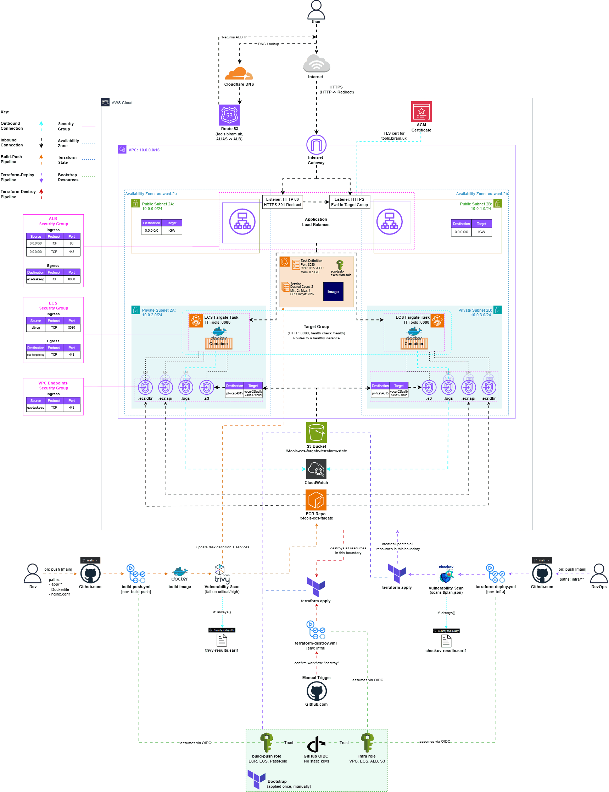
 
A user request resolves `tools.biram.uk` through Cloudflare, which delegates the subdomain to a Route 53 hosted zone containing an alias record pointing at the ALB. Traffic enters the VPC through the Internet Gateway and hits the ALB in the public subnets. The HTTP:80 listener issues a 301 redirect to HTTPS. The HTTPS:443 listener terminates TLS using the ACM certificate and forwards to the target group on port 8080.
 
The target group routes to ECS Fargate tasks running in private subnets across `eu-west-2a` and `eu-west-2b`, health-checked on `/health` expecting a 200. The tasks sit in private subnets with no `0.0.0.0/0` route, they reach ECR, CloudWatch Logs, and S3 through VPC endpoints instead: three interface endpoints (`ecr.api`, `ecr.dkr`, `logs`) with ENIs inside the private subnets, and one S3 gateway endpoint attached to the private route table via prefix list.
 
Security groups form a strict chain, each referencing the next by security group ID rather than CIDR:
 
| Security group | Ingress | Egress |
|---|---|---|
| `alb-sg` | 80, 443 from `0.0.0.0/0` | 8080 to `ecs-tasks-sg` |
| `ecs-tasks-sg` | 8080 from `alb-sg` | 443 to `ecs-fargate-sg` |
| `ecs-fargate-sg` | 443 from `ecs-tasks-sg` | - |
 
The CI/CD band beneath the AWS boundary shows the three pipelines, the GitHub Environments that scope them, and the bootstrap OIDC provider and IAM roles that each pipeline assumes.
 
---

## Project Structure
 
```
it-tools-ecs-fargate/
├── .github/
│   └── workflows/
│       ├── build-push.yml            # build, scan, push, deploy to ECS
│       ├── terraform-deploy.yml      # fmt, init, validate, plan, Checkov, apply
│       └── terraform-destroy.yml     # manual only, confirmation gated
├── app/                              # IT Tools source (Vue 3 SPA)
├── bootstrap/                        # applied once, manually
│   ├── main.tf                       # OIDC provider + 2 scoped IAM roles
│   ├── outputs.tf                    # role ARNs for GitHub Secrets
│   └── providers.tf                  # separate S3 state key
├── images/                           # README screenshots and diagram
├── infra/
│   ├── main.tf                       # module calls + Route 53 zone lookup
│   ├── variables.tf
│   ├── outputs.tf
│   ├── providers.tf                  # AWS provider + S3 backend
│   ├── terraform.tfvars.example      # expected variable shape
│   └── modules/
│       ├── vpc/                      # VPC, 4 subnets, IGW, route tables
│       ├── sg/                       # 3 security groups + rules
│       ├── endpoints/                # 3 interface + 1 gateway endpoint
│       ├── acm/                      # certificate, validation record, wait
│       ├── alb/                      # ALB, 2 listeners, target group, alias record
│       ├── ecr/                      # data source for existing repository
│       ├── iam/                      # ECS task execution role
│       └── ecs/                      # cluster, task definition, service, autoscaling
├── .dockerignore
├── .gitignore
├── Dockerfile                        # multi-stage: node builder → nginx-unprivileged
├── nginx.conf                        # SPA fallback + /health endpoint
└── README.md
```

 ---
 
## App Demo
 
The application served over HTTPS at `https://tools.biram.uk`:
 
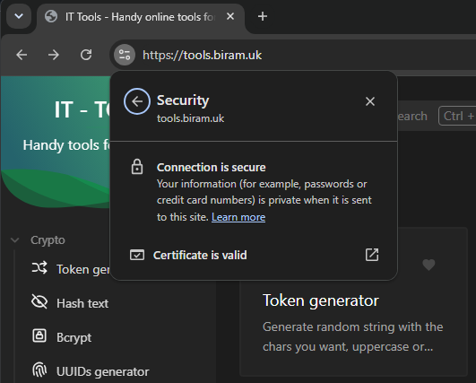
 
Certificate issued by ACM for `tools.biram.uk`:
 
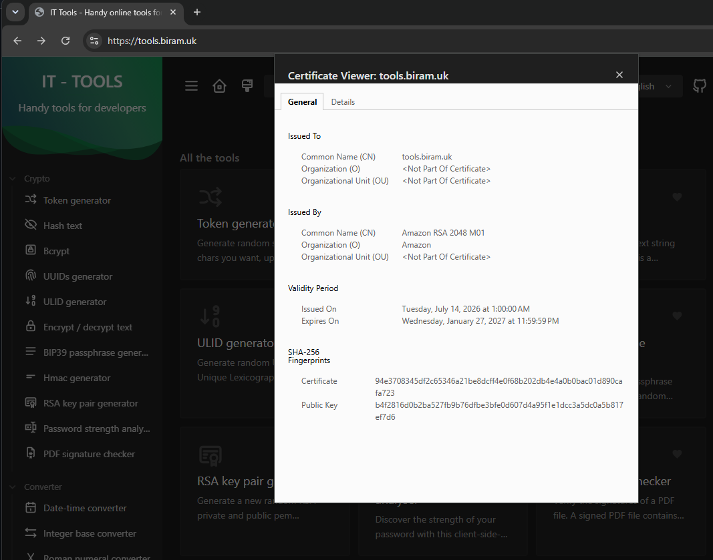
 
A deep-linked tool page after a hard refresh, confirming SPA routing is handled correctly by nginx rather than returning a 404:
 

 
Health endpoint:
 
```bash
curl https://tools.biram.uk/health
{"status":"ok"}
```
 
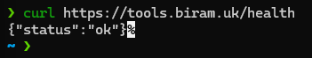
 
---
 
## CI/CD Pipelines
 
All three pipelines authenticate to AWS through OIDC. None store AWS credentials.
 
### Application pipeline - `build-push.yml`
 
Triggers on push to `main` touching `app/**`, `Dockerfile`, or `nginx.conf`, or manually via `workflow_dispatch`. Runs under the `build-push` environment and assumes `github-actions-build-push-role`.
 
Builds the image with Buildx (`push: false`, `load: true`) so it exists locally but is not yet published, scans it with Trivy failing on CRITICAL or HIGH, uploads SARIF to the Security tab, then pushes the SHA-tagged image to ECR. The scan gate sits deliberately between build and push so a vulnerable image never reaches the registry. It then reads the live task definition, patches the image field, registers a new revision, updates the service with `wait-for-service-stability`, and curls `https://tools.biram.uk/health`.
 
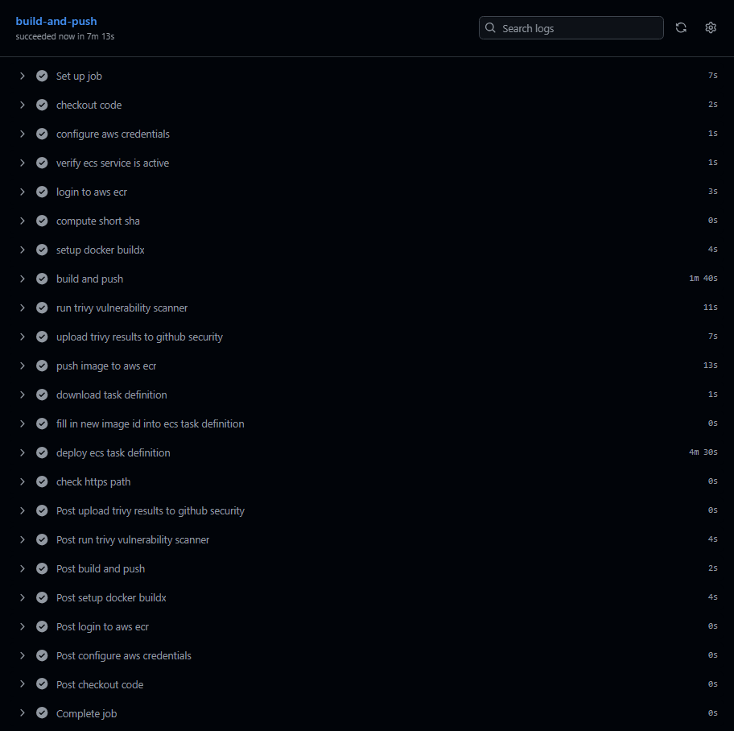
 
### Infrastructure pipeline - `terraform-deploy.yml`
 
Triggers on push to `main` touching `infra/**`, or manually. Runs under the `infra` environment and assumes `terraform-infra-deploy-destroy-role`.
 
Runs `fmt -check` (which fails rather than silently rewriting files), `init` against the S3 backend, `validate`, `plan -out=tfplan`, converts the plan to JSON, scans it with Checkov, uploads SARIF, applies the saved plan, waits for the ECS service to stabilise, then health-checks the live domain.
 
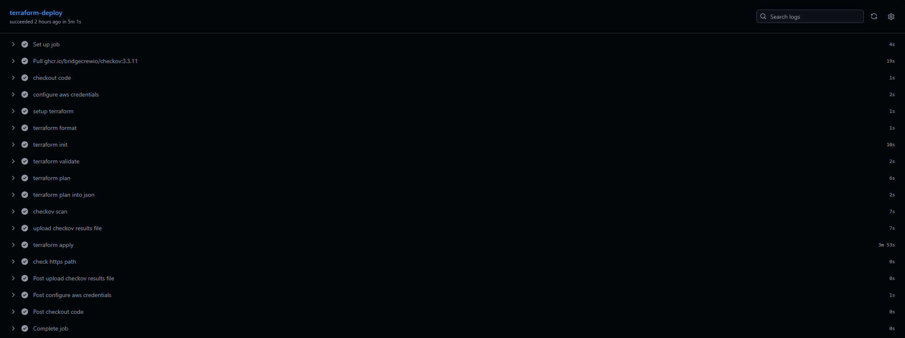
 
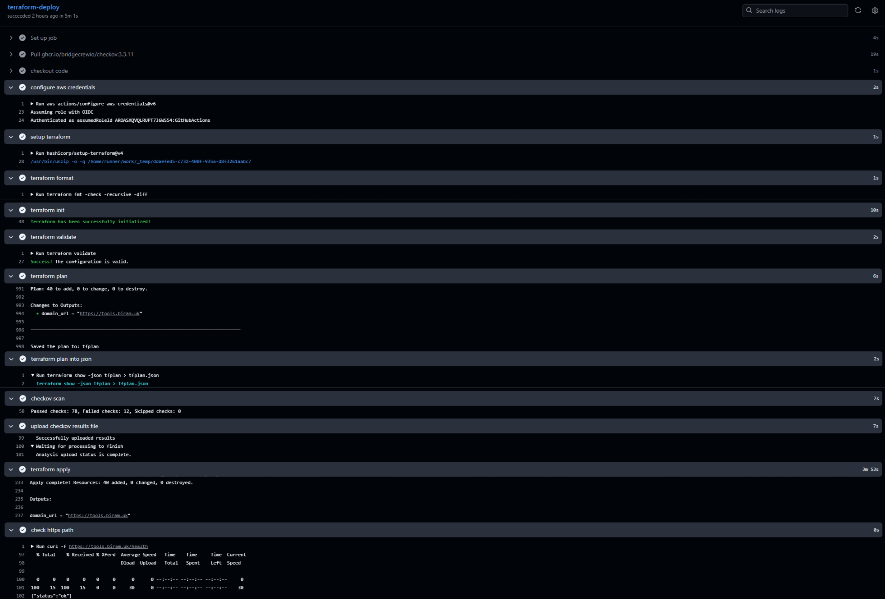
 
### Destroy pipeline - `terraform-destroy.yml`
 
`workflow_dispatch` only, with no push trigger of any kind. The first step compares a required input against the literal string `destroy` and exits non-zero on mismatch, so an accidental click cannot tear down the environment. It then runs `plan -destroy -out=tfplan` - making the full removal list reviewable in the log - before applying that saved plan.
 
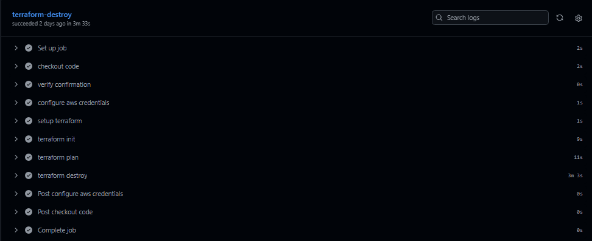
 
### Full lifecycle
 
All three pipelines run in sequence: deploy, then build and push, then destroy.
 
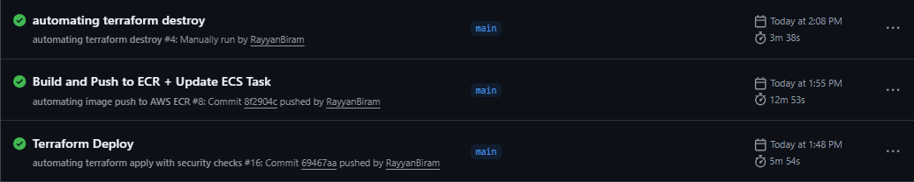
 
The same three runs with their key steps expanded - plan counts, Trivy and Checkov results, apply and destroy totals, and both health checks:
 
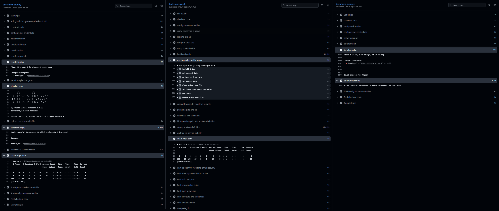
 
Scanner findings published to the repository Security tab:
 
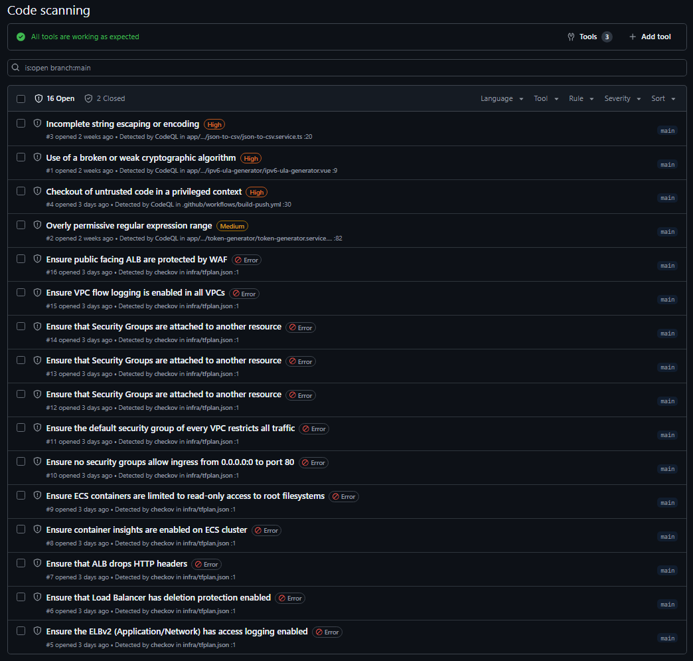
 
---

## Design Decisions
 
**Two-stage Terraform split.** `bootstrap/` and `infra/` are separate Terraform roots with separate state keys in the same S3 bucket. The pipelines need an IAM role to authenticate, but that role is itself infrastructure. `bootstrap/` is applied once, manually, from a laptop, creating the OIDC provider and both CI roles. Everything in `infra/` then runs through CI/CD. Keeping them in separate state also means a routine `terraform destroy` of the app stack can never remove the trust relationship the pipelines depend on.
 
**VPC endpoints over a NAT gateway.** ECS tasks in private subnets need to pull images from ECR and ship logs to CloudWatch. Three interface endpoints plus an S3 gateway endpoint cost slightly more than a single NAT gateway at this scale, but keep that traffic entirely inside the AWS network and remove a single point of egress failure. The S3 gateway endpoint is required rather than optional: ECR stores image layers in S3, so a task can authenticate against `ecr.api` and still fail to pull without it.
 
**CI owns the image tag, Terraform owns everything else.** Terraform creates the cluster, service, IAM roles, and an initial task definition pointing at a known-good image from the ClickOps phase. From that point it permanently cedes `task_definition` to CI via `lifecycle { ignore_changes }`. The application pipeline reads the live task definition with `describe-task-definition`, patches only the image field, registers a new revision, and calls `update-service`. Reading the live definition rather than a template file means CPU, memory, log config, and execution role can never drift out of sync with what Terraform created. The `ignore_changes` block here formalises an ownership boundary that was already true, rather than hiding surprise drift.
 
**ECR referenced as a data source, not managed.** The ECR repository was created once during the ClickOps phase and holds the bootstrap image the first `terraform apply` depends on. It is referenced with `data "aws_ecr_repository"` rather than managed as a resource, avoiding a state import while preserving the existing pushed image. This is a deliberate, documented exception to "everything in Terraform."
 
**Immutable SHA tags.** The ECR repository is configured with immutable tags and images are tagged with the short commit SHA rather than `latest`, so any running image traces back to an exact commit and no tag can silently be overwritten. This surfaces as a pipeline failure when re-running a workflow against an unchanged commit. That is the control working as intended, not a defect.
 
**S3-native state locking.** The backend uses `use_lockfile = true` rather than a DynamoDB lock table, which is now the deprecated approach. The lock is an object in the same state bucket, which is why the CI role needs `s3:DeleteObject` to release it. `bootstrap/` and `infra/` share the bucket but use different state keys (`bootstrap/terraform.tfstate` and `terraform.tfstate`), and the AWS provider is pinned to `6.53.0` in both roots.
 
**Plan artefact is what gets applied.** Both Terraform pipelines run `plan -out=tfplan`, scan that plan, then `apply tfplan` - applying the exact plan that was scanned, rather than recomputing at apply time. For the destroy pipeline this also means the full list of resources to be removed is reviewable in the log before anything is torn down.
 
---
 
## Security
 
**OIDC over static credentials.** GitHub Actions authenticates via `token.actions.githubusercontent.com` using short-lived tokens. No AWS access keys exist in the repository or in GitHub Secrets, only role ARNs.
 
**Two scoped roles, not one.** The application pipeline and the Terraform pipelines assume different roles. `github-actions-build-push-role` carries a hand-written least-privilege policy: ECR push/pull scoped to one repository ARN, the four ECS actions needed to register and deploy a task definition, and `iam:PassRole` scoped to exactly one execution role ARN. `terraform-infra-deploy-destroy-role` is necessarily broader, using AWS service-scoped managed policies plus custom inline policies for IAM, S3 state, and Application Auto Scaling. The narrow, high-frequency role gets a fully custom policy. The broad, infrequent one uses per-service managed policies - a stated trade-off rather than a default.
 
**Trust policies pinned to GitHub Environments.** Each role's trust policy matches on the `sub` claim containing the environment name (`repo:RayyanBiram/it-tools-ecs-fargate:environment:build-push` and `:environment:infra`), plus an `aud` condition of `sts.amazonaws.com`. A workflow running under the wrong environment cannot assume the other role.
 
**Non-root container.** The runtime image is `nginxinc/nginx-unprivileged:alpine`, running as UID 101 (non-root user) and listening on 8080 rather than a privileged port. The final image carries no Node runtime, no pnpm, and no build toolchain - those live only in the discarded builder stage.
 
**Scanned before it ships.** Trivy scans the built image for CRITICAL and HIGH vulnerabilities and fails the build before the image is ever pushed to ECR. Checkov scans the Terraform plan JSON. Both publish SARIF to the repository's Security tab.
 
**TLS 1.3 at the load balancer.** The HTTPS listener uses `ELBSecurityPolicy-TLS13-1-2-2021-06`, with TLS 1.2 as fallback.
 
**Tasks unreachable from the internet.** ECS tasks have no public IP (`assign_public_ip = false`) and sit in subnets with no `0.0.0.0/0` route. The only inbound path is port 8080 from the ALB's security group.
 
---
 
## Known Limitations and Trade-Offs
 
Checkov reports 78 passed and 12 failed checks against the plan. Findings are non-blocking (`soft_fail: true`) and reviewed rather than suppressed:
 
| Check | Finding | Position |
|---|---|---|
| `CKV_AWS_260` | Security group allows ingress from `0.0.0.0/0` on port 80 | By design. Port 80 exists solely to 301-redirect to HTTPS. |
| `CKV2_AWS_28` | Public ALB not protected by WAF | Accepted. WAF carries ongoing cost disproportionate to a zero-traffic portfolio deployment. |
| `CKV_AWS_91` | ALB access logging disabled | Accepted. Requires an additional S3 bucket and lifecycle policy for no real benefit at this traffic level. |
| `CKV2_AWS_11` | VPC flow logs disabled | Accepted for the same cost reason. Would be enabled in a production environment. |
| `CKV_AWS_150` | ALB deletion protection disabled | Deliberate. Enabling it would block the Terraform destroy pipeline, which is a required deliverable. |
| `CKV2_AWS_5` | Security groups not attached to a resource | False positive. All three groups are attached to the ALB and ECS tasks at apply time; the static plan scan cannot resolve this. |
| `CKV_AWS_131` | ALB does not drop invalid HTTP headers | Acknowledged, not yet implemented. |
| `CKV_AWS_65` | Container Insights not enabled on the ECS cluster | Acknowledged. Adds CloudWatch cost for observability not currently needed. |
| `CKV_AWS_336` | Container root filesystem is writable | Acknowledged. nginx requires write access to temp and PID paths. nginx would need tmpfs mounts to resolve properly. |
| `CKV2_AWS_12` | Default VPC security group does not restrict all traffic | Acknowledged. No resource uses the default security group. |
 
CodeQL also reports findings against the vendored application source (`json-to-csv`, `ipv6-ula-generator`, `token-generator`). The application code is upstream IT Tools, unmodified. I did not write it, and patching vendored source would diverge this repository from upstream for no operational benefit. These alerts are dismissed in the Security tab with a note to that effect. My own code in this repository is the Dockerfile, nginx config, Terraform, and workflows, all of which are scanned by Trivy and Checkov.
 
Other trade-offs worth stating plainly:
 
- The ECR repository and the S3 state bucket are both created outside Terraform, by design (see Design Decisions). Every other resource is Terraform-managed.
- The CloudWatch log group is created implicitly by ECS via `awslogs-create-group` rather than as a tracked Terraform resource, so it is not removed by `terraform destroy`.
- There is a single environment. Staging and production would need separate state keys and variable sets.

---
 
## Local Setup
 
### Prerequisites
 
| Tool | Purpose | Verify |
|---|---|---|
| Docker | Build and run the image locally | `docker --version` |
| Terraform | Provision infrastructure (CI runs 1.15.x) | `terraform --version` |
| AWS CLI | Authenticate and bootstrap | `aws sts get-caller-identity` |
| A delegated domain | ACM validation and the ALB alias record | - |
 
### Run the container locally
 
```bash
git clone https://github.com/RayyanBiram/it-tools-ecs-fargate.git
cd it-tools-ecs-fargate
 
docker build -t it-tools .
docker run -d -p 8080:8080 --name it-tools it-tools
```
 
```bash
curl http://localhost:8080/health
{"status":"ok"}
```
 
Open [http://localhost:8080](http://localhost:8080). Navigate into any tool and hard-refresh to confirm the nginx SPA fallback works.
 
```bash
docker stop it-tools && docker rm it-tools
```
 
The container runs as UID 101 and listens on 8080 internally. Verify with:
 
```bash
docker exec it-tools id
uid=101(nginx) gid=101(nginx) groups=101(nginx)
```
 
---
 
## Reproducing the Deployment
 
### 1. Create the prerequisites by hand
 
Three things exist outside Terraform and must be created first:
 
- An S3 bucket for Terraform state (this project uses `it-tools-ecs-fargate-terraform-state`)
- An ECR repository (`it-tools-ecs-fargate`), with an initial image pushed and tagged with a short commit SHA
- A Route 53 hosted zone for your subdomain, with NS records delegated from your registrar
Verify the delegation before going further, because a broken one causes ACM validation to hang for 45 minutes and then fail:
 
```bash
nslookup -type=NS tools.biram.uk 8.8.8.8
```
 
The nameservers returned must match those in the Route 53 hosted zone.
 
### 2. Apply the bootstrap
 
```bash
cd bootstrap
terraform init
terraform plan
terraform apply
terraform output
```
 
Note both role ARNs from the output.
 
### 3. Create the GitHub Environments
 
In **Settings → Environments**, create two environments: `build-push` and `infra`. The names matter - they appear in the OIDC token's `sub` claim and are matched by each role's trust policy.
 
**`build-push` → Secrets:**
 
| Name | Value |
|---|---|
| `AWS_BUILD_PUSH_ROLE_ARN` | `build_push_role_arn` from bootstrap output |
 
**`build-push` → Variables:**
 
| Name | Example |
|---|---|
| `AWS_REGION` | `eu-west-2` |
| `ECS_REPOSITORY` | `it-tools-ecs-fargate` |
| `ECS_CLUSTER` | `ecs-cluster` |
| `ECS_SERVICE` | `ecs-task-definition-service` |
| `ECS_TASK_DEFINITION` | `ecs-task-definition` |
| `CONTAINER_NAME` | `ecs-task-definition` |
 
**`infra` → Secrets:**
 
| Name | Value |
|---|---|
| `AWS_INFRA_ROLE_ARN` | `infra_role_arn` from bootstrap output |
 
**`infra` → Variables:** one per Terraform variable, matching `infra/terraform.tfvars.example`. Values must be entered raw - no surrounding quotes on plain strings, and valid HCL list syntax for lists:
 
| Name | Value |
|---|---|
| `AWS_REGION` | `eu-west-2` |
| `DOMAIN_NAME` | `tools.biram.uk` |
| `VPC_CIDR` | `10.0.0.0/16` |
| `AVAILABILITY_ZONE` | `["eu-west-2a", "eu-west-2b"]` |
| `PUBLIC_SUBNET_CIDR` | `["10.0.0.0/24", "10.0.1.0/24"]` |
| `PRIVATE_SUBNET_CIDR` | `["10.0.2.0/24", "10.0.3.0/24"]` |
| `ROUTE_CIDR` | `0.0.0.0/0` |
| `ALB_INGRESS_PORT` | `[80, 443]` |
| `PROTOCOL` | `tcp` |
| `CIDR_IPV4` | `0.0.0.0/0` |
| `CONTAINER_PORT` | `8080` |
| `TASKS_EGRESS_PORT` | `443` |
| `FARGATE_INGRESS_PORT` | `443` |
| `TARGET_GROUP_PROTOCOL` | `HTTP` |
| `REPOSITORY_NAME` | `it-tools-ecs-fargate` |
| `IMAGE_TAG` | `c67d9d3` |
 
`ECS_CLUSTER` and `ECS_SERVICE` are also needed in the `infra` environment for the post-apply stability wait. Environment variables are not shared between environments.
 
### 4. Run locally first, or push
 
For a local apply, copy `infra/terraform.tfvars.example` to `infra/terraform.tfvars` and fill it in:
 
```bash
cd infra
terraform init
terraform plan
terraform apply
```
 
Otherwise, push a change under `infra/**` and `terraform-deploy.yml` runs the same sequence in CI.
 
### 5. Deploy the application
 
Push a change under `app/**`, `Dockerfile`, or `nginx.conf`, or trigger `build-push.yml` manually. The pipeline builds, scans, pushes a SHA-tagged image, registers a new task definition revision, updates the service, waits for stability, and health-checks the live domain.
 
### 6. Tear down
 
**Actions → automating terraform destroy → Run workflow**, type `destroy` into the confirmation field, and run. Then, if removing the bootstrap:
 
```bash
cd bootstrap
terraform destroy
```
 
---
 
## Future Improvements
 
- **Terraform plan on pull requests.** A separate plan-only pipeline gated on PRs, so infrastructure changes are reviewable before merge rather than at apply time.
- **AWS WAF on the ALB** for edge filtering of SQL injection, XSS, and known-bad IPs.
- **VPC flow logs and ALB access logging**, with an S3 lifecycle policy to control retention cost.
- **Read-only root filesystem** on the container, with tmpfs mounts for the paths nginx genuinely needs to write.
- **Separate staging and production environments**, using distinct state keys and variable sets against the same modules.
- **CloudWatch dashboards and alarms** on task count, target group health, and CPU, so autoscaling behaviour is observable rather than inferred.
 